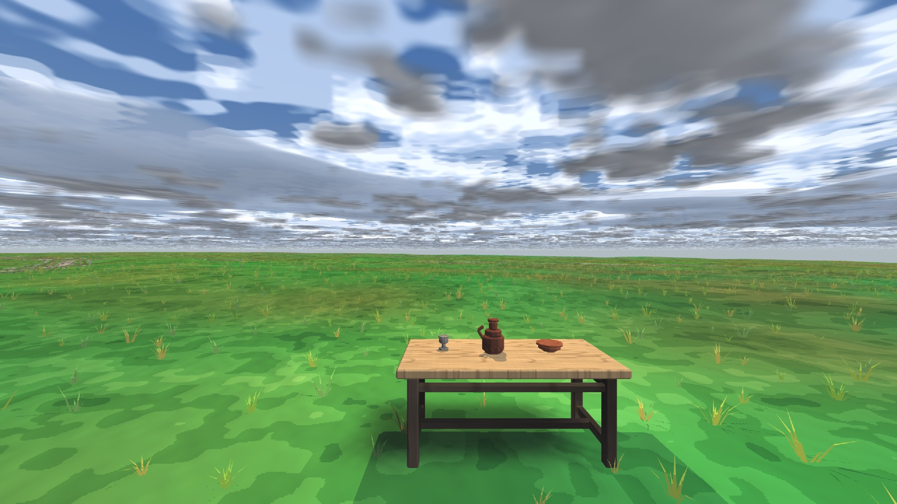
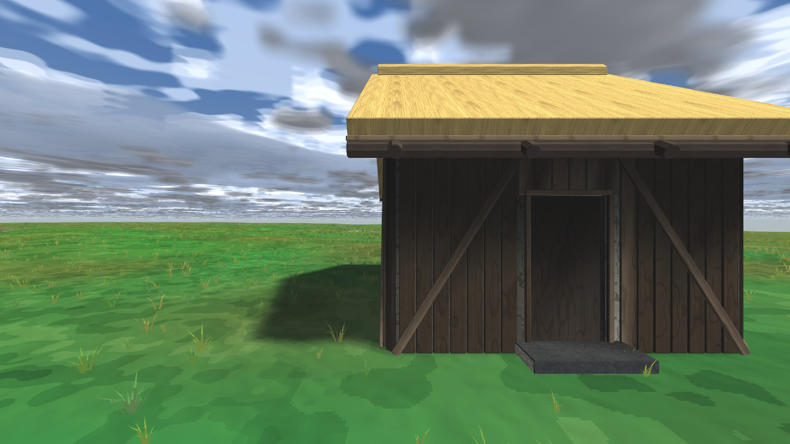
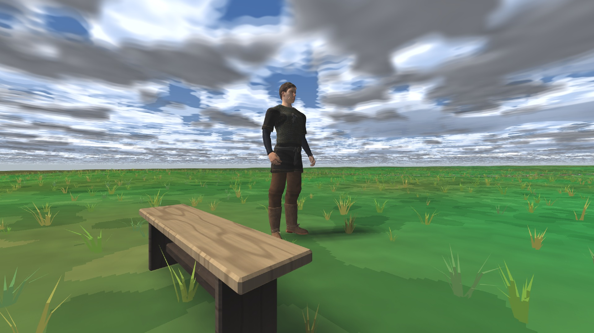

# dfn — блог разработки движка

dfn — движок ролевых игр от первого лица, на котором студия делает [Yaan](https://github.com/SpiralGameStudios/Yaan-devlog) и [Dusk UnFair](https://github.com/SpiralGameStudios/DuskUnFair-devlog). Код закрыт; здесь — что движок умеет, где он сейчас и что дальше.

| | |
|:---:|:---:|
|  |  |

*Стенды движка: предметы на лугу с тенями в реальном времени и травой; дом, собранный из деталей по данным, с интерьером; скиннинговый персонаж в многослойной одежде.*

## Что умеет

- **Мир чанками** с дальней сеткой и потоковой подгрузкой; воксельная земля, которую можно резать и копать; дома собираются из готовых деталей.
- **Рендер** на bgfx (Metal): солнечные и точечные тени, дымка и небо с лунами, флора с уровнями детализации, качество тремя уровнями под слабое железо.
- **Физика** Jolt: капсула персонажа, лестницы и пандусы, предметы, которые можно взять в руки.
- **Персонажи**: импорт из glTF, риг, скиннинг, слои анимации (ходьба, взгляд, верх тела), IK стоп по рельефу; выпечка тел из MakeHuman.
- **Сеть**: транспорт через Steam и локальная петля, реплика состояний, кооператив.
- **Редактор** внутри игры: свободная камера, постройка домов, кисть ландшафта.
- **Проверки**: 170 автоматических тестов, среди них сверка кадров побитово и проверка, что каждый коммит собирается сам по себе.

## Статус — сентябрь 2026

- Движок вынесен в отдельный репозиторий и собирается из чистого клона без единой строки игры. Обе игры подключают его как библиотеку по зафиксированной версии.
- Окно в беспилотных прогонах (тесты, съёмка кадров) больше не забирает фокус у пользователя.
- Общий конвейер выпечки персонажей: одна функция для всех игр, побитово та же выпечка, что была у Yaan.

## Ближайшие планы

1. Слой действий в анимации — атака, реакция на удар, смерть — как общий механизм для обеих игр; клипы и тайминги остаются данными игры.
2. Конвейер персонажей для не-людей: сначала клипы, потом роли костей, потом другое число ног.
3. Точечные тени от скиннинговых тел (в подземельях с факелами персонажи пока без тени).
4. Быстрая первая сборка: зависимости без полной истории.
5. Windows и Linux — после первого релиза Dusk UnFair.

## Записи

- **2026-09-25.** Разрез монорепозитория на три: движок, Yaan, Dusk UnFair. Каждая репа собирается из своего клона, тесты зелёные (движок 163, Yaan 124, Dusk 12). Заведена организация и эта витрина.
- **2026-09-23.** Ночь удаления общего заголовка констант: из движка ушли все числа игры, у тестов движка появились синтетические фикстуры вместо контента Yaan.
- **2026-09-16.** Рендер разделён на фичи прохода с порядком по слотам; трава, рассев и флора уехали в игру как контент.

